Given your context — DinD (Docker-in-Docker) on EKS with Karpenter — here's a comprehensive breakdown of all the major GitHub Actions self-hosted runner architectures, their trade-offs, and how they compare.Here's the full breakdown of all six architectures:

---

## 1. Docker-in-Docker (DinD) — your current setup

Each runner pod runs its own Docker daemon, usually as a privileged sidecar or init container. Jobs get full daemon isolation from other pods.

**Pros:** Clean layer-cache control per pod, docker compose works natively, familiar tooling, good job-level isolation.

**Cons:** Requires `privileged: true`, which is a significant security concern — a compromised job can escape to the node. Daemon startup adds cold-start latency (typically 3–10s). Karpenter node recycling can kill a warm daemon mid-job. Layer caches are lost when pods are evicted.

---

## 2. Docker-out-of-Docker (DooD)

Mounts the host's `/var/run/docker.sock` into the runner pod. The runner talks to the node's actual Docker daemon.

**Pros:** No daemon startup cost, fastest "docker build" path, simple to configure.

**Cons:** Effectively root on the node — any job that has the socket has host-level access. Jobs share a single daemon, so a build on one job can interfere with another. Entirely incompatible with multi-tenant or security-conscious environments.

---

## 3. Rootless / daemonless builders (Kaniko, Buildah, BuildKit rootless)

No Docker daemon at all. Tools like Kaniko or Buildah build OCI images from within an unprivileged container and push directly to a registry.

**Pros:** No privileges required, fully Pod Security Admission (PSA) compliant, works on any standard EKS node, great compliance posture.

**Cons:** No local daemon = no layer cache by default (though remote cache backends in BuildKit help). Docker Compose is unavailable. Build speeds for large images can be slower without a warm cache. Requires changing your CI pipeline tooling.

---

## 4. VM-per-job (Firecracker / Kata Containers)

Each job gets a dedicated microVM with its own kernel. Firecracker (used by GitHub's own hosted runners) boots in ~125ms.

**Pros:** Strongest possible isolation — a compromised job cannot affect the node. Can run Docker natively inside the VM. Works well with Karpenter since you provision nodes and let the VMM manage jobs on top.

**Cons:** Requires bare-metal EC2 instances (e.g., `metal` or `nitro`-based types that support KVM), which are significantly more expensive. Complex to operate. Kata Containers adds overhead. ARC doesn't natively support this — you'd need custom tooling like `vcluster` or Warpbuild-style automation.

---

## 5. Actions Runner Controller (ARC) — ephemeral pod-per-job

A Kubernetes operator that watches GitHub's webhook for queued jobs and spins up a fresh runner pod per job, then tears it down immediately after.

**Pros:** Naturally ephemeral and clean — no state leaks between jobs. Works natively with Karpenter scale-out/in. Can combine with DinD (arch 1), rootless (arch 3), or even VM (arch 4). Well-maintained by GitHub. The best fit for EKS + Karpenter.

**Cons:** Pod scheduling latency (Karpenter node provisioning + pod startup) adds ~30–90s cold start in the worst case. Requires managing ARC's own controller pods and `RunnerScaleSet` CRDs. Image pull time matters — large runner images slow everything down.

---

## 6. Durable / bare-metal node runner

A long-lived runner process on a static EC2 instance, registered as a GitHub self-hosted runner. No Kubernetes involved.

**Pros:** Fastest cold start — no pod scheduling. Zero Kubernetes complexity for the runner itself. Simplest ops model.

**Cons:** State leaks between jobs unless you script cleanup. Karpenter can't manage these nodes (they're not ephemeral). No horizontal scaling story. Security depends entirely on job isolation scripts. Mostly useful for specific hardware requirements (GPUs, large memory) rather than general CI.

---

## How they compare on your key concerns

| Architecture | Security | Docker compose | Layer caching | Karpenter fit | Cold start |
|---|---|---|---|---|---|
| DinD (current) | Medium | ✓ | ✓ local | Good | Medium |
| DooD | Poor | ✓ | ✓ shared | Poor | Fast |
| Rootless / Kaniko | Best | ✗ | Remote only | Excellent | Fast |
| VM-per-job | Excellent | ✓ | ✓ | Good | Medium |
| ARC + ephemeral pod | Good–Best | depends | depends | Excellent | Medium |
| Durable node | Poor | ✓ | ✓ | Poor | Fastest |

---

## Recommendation given your EKS + Karpenter setup

If you're staying on Kubernetes, the natural evolution from your current DinD setup is **ARC with ephemeral runner pods** — you keep DinD inside the pod for now (maintaining docker compose compatibility) while gaining per-job cleanliness and proper Karpenter integration. The next step from there is moving to **rootless BuildKit** to drop the `privileged` requirement entirely, trading local layer cache for a remote registry cache (ECR works well here).

VM-per-job is worth exploring only if you have compliance requirements that mandate kernel-level isolation — the cost and complexity jump is real.